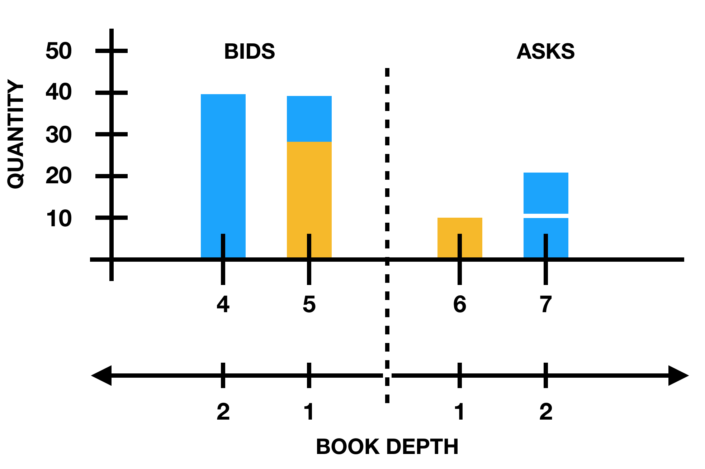

# Order book implementation
The project simulates simplified model of an order book on a financial exchange.

The constraint is not to use libraries other than what is necessary for the tests.

## Architecture
This project following the hexagonal architecture :
- the package `application` contains code to interact with the application. In that case, the interaction with the console. 
- the package `domain` contains the business logic and the business objects.


## Usage

### Run
```
sbt "run lot-of-updates.txt 10.0 100"
```
- `filename`: the name of the file containing the input data. The file contains instructions to update the order book. Line example : `N B 1 5 30`
    - Instruction: `N`ew, `U`pdate or `D`elete.
    - Side: `B`id or `A`sk.
    - Price Level Index: Price Level Index of change in range `1..book_depth`.
    - Price: Price in ticks.
    - Quantity: Number of contracts at price level.
- `tick size`: a floating point number giving the minimum $ price movements.
- `book depth`: an integer giving the number of price levels to keep track of.

#### Output
```
Bid Price[1], Bid Quantity[1], Ask Price[1], Ask Quantity[1] 
... 
Bid Price[n], Bid Quantity[n], Ask Price[n], Ask Quantity[n]
```
Where n is the book depth and price is in $.


### Test
```
sbt test
```

## Complexity
The complexity of the algorithm itself is `O(|updateOrderBookCommands| + book_depth)`. The parser part could probably be improved to be quicker.


## Example
- `lot-of-updates.txt`
```
N B 1 5 30
N B 2 4 40
N A 1 6 10
N A 2 7 10
U A 2 7 20
U B 1 5 40
```

```
sbt "run lot-of-updates.txt 10.0 100"
```
- Output
```
50.0,40,60.0,10
40.0,40,70.0,20
```
- Visually 

